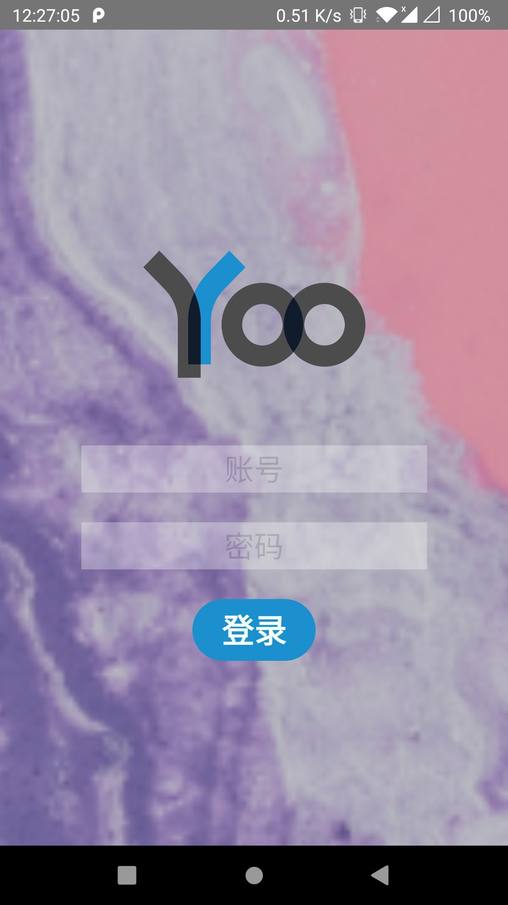

# YooMooc RN

哟慕课 APP 是一个第三方的优慕课客户端

## 🎞 背景

无论是电脑版还是手机版的优慕课客户端用起来似乎都不是那么令人满意，电脑版在课程页面只能看到标题不能看到详情，手机版从详情页退出后会回到最顶端。于是就有了做一个第三方客户端的想法，也当是 React Native 的一次练手了

## 🧨 版本说明

| 版本   | 说明         |
| ------ | ------------ |
| 0.0.1a | 首个可用版本 |

## 📄 TODO

- [ ] 弹出键盘不遮挡输入框
- [ ] 根据像素比例设置登录背景图片大小
- [ ] 添加应用图标
- [ ] 适配 iOS 登录失败 toast
- [ ] 在启动时检测是否已登录
- [ ] Splash 检测网络出错后在 Splash UI 中显示错误并不跳转
- [ ] Forum 初始化失败后 UI 显示错误信息
- [ ] 当数据获取完成后通过动画转到话题列表
- [ ] 解决当动画进行时点击话题标题动画会被打断的问题
- [ ] 支持显示回复图片
- [ ] 在回复中显示头像
- [ ] 当滑动到页面底部时显示"加载更多"

